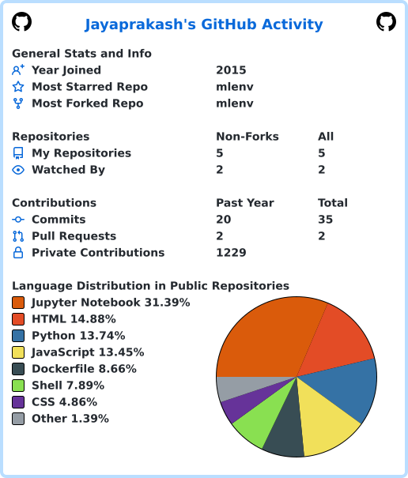

<h1 align="center">Hi 👋, I'm Jayaprakash Nallathambi</h1>
<h3 align="center">Senior Data Engineer & People Manager · 19+ yrs Data Engineering, ML/NLP → now building in GenAI/Data+AI</h3>

  
  
  
  

  

---

### 🧑‍💻 About me

I've spent 19+ years building end-to-end data platforms — pipelines, ML/NLP systems and BI reporting — across telecom, national geospatial infrastructure, financial services and enterprise consulting. Most recently I've been delivering national-scale data products for **Ordnance Survey's Core Data Services Platform** and an LLM-assisted prospecting pipeline for **Foundation Risk Partners**, while line-managing a team of 3 data engineers at **Version 1**.

I'm currently extending that platform/ML background into modern **GenAI engineering** — RAG systems, agentic workflows, dbt-based analytics engineering, and the emerging MCP tooling ecosystem. The projects below are that build-in-public log.

- 🔭 Currently building: a RAG assistant, a dbt-orchestrated analytics pipeline, and an MCP server — see **Featured Projects** below
- 🌱 Learning: Retrieval-Augmented Generation, agentic frameworks (LangChain/LangGraph), Model Context Protocol
- 👯 Open to: Lead Data Engineer / Data Engineering Manager / Data+AI Engineer roles
- 📫 Reach me: jayaprakash.nallathambi@gmail.com · [LinkedIn](https://www.linkedin.com/in/jayaprakash-nallathambi)

---

### 🛠️ Core Skills

**Data Engineering:** Python · **Scala** · **PySpark** · Spark · Spark SQL · SQL · distributed & event-driven pipelines
**Cloud & Platforms:** **Azure Databricks** · **MS Fabric** · Azure Data Factory · Azure DevOps · Logic Apps · GCP (BigQuery, Dataflow, Pub/Sub) · AWS (Lambda, S3)
**GenAI / AI Engineering:** LLM APIs (Gemini, Groq) · RAG (chunking, embeddings, hybrid retrieval, reranking) · LangChain · Ragas evaluation · Model Context Protocol (MCP)
**Analytics Engineering:** dbt · dimensional modelling · Airflow
**Machine Learning & NLP:** TensorFlow · PyTorch · Scikit-learn · BERT · NER · sentiment analysis · time-series forecasting
**BI & Visualisation:** Power BI · Tableau · R Shiny
**Leadership:** Line management (3 direct reports) · mentoring & coaching · stakeholder management

---

### 🏅 Certifications

- **Databricks Certified Data Engineer Professional** — Databricks · [Show Credential](https://credentials.databricks.com/3b3e497a-4df6-4859-b04d-a144300437ac#acc.AZ4RIMwH)
- **Data Engineering, Big Data, and Machine Learning on GCP** — Google Cloud · [Show Credential](#) <!-- replace with your Coursera/Skills Boost verify URL -->
- **Machine Learning** — Stanford University (Coursera) · [Show Credential](#) <!-- replace with your Coursera verify URL -->
- **Business Intelligence Implementation Specialist** — Oracle · [Show Credential](#) <!-- replace with your Oracle CertView verify URL -->
- **Tableau Analyst** — Tableau · [Show Credential](#) <!-- replace with your Credly badge URL -->

---

### 🚀 Featured Projects

| Project | Status | Description | Stack |
|---|---|---|---|
| [🔗 RAG Technical Assistant](https://github.com/jprakash0205/rag-technical-assistant) | 🚧 In progress | RAG chatbot over a real technical document corpus, with a Ragas-based evaluation suite (faithfulness, relevancy, context precision) and a live demo | Python · Qdrant · LangChain · Gemini/Groq · Streamlit |
| [🔗 dbt Analytics Pipeline](https://github.com/jprakash0205/dbt-analytics-pipeline) | 🚧 In progress | Orchestrated analytics engineering pipeline — staging/mart models, automated tests, generated docs, scheduled via Airflow | dbt · DuckDB/BigQuery · Airflow · Docker |
| [🔗 MCP Warehouse Server](https://github.com/jprakash0205/mcp-warehouse-server) | 🚧 In progress | An MCP server exposing the dbt warehouse above as callable tools for MCP-aware clients (e.g. Claude Desktop) | Python · MCP SDK |

<!-- > Links go live as each project ships — see [`docs/CHECKLIST.md`](docs/CHECKLIST.md) for the full build log and week-by-week plan. -->

---

### 📌 Other repos

| Repo | What it is | Note |
|---|---|---|
| [mlenv](https://github.com/jprakash0205/mlenv) | Dockerised ML environment — JupyterLab, VS Code Server, full remote desktop (XFCE/noVNC), monitoring, all in one image | README + Apache-2.0 `LICENSE`/`NOTICE` added (derived from ml-workspace, attribution required) |
| [SnippetVault](https://github.com/jprakash0205/SnippetVault) | Local Flask app for managing personal code snippets as Markdown files with search, filtering and pinning | README + MIT `LICENSE` added. Solid, clean Flask work — kept here rather than pinned, since it's general software craftsmanship rather than data/AI engineering |
<!-- | [jp-blog](https://github.com/jprakash0205/jp-blog) | Personal blog built in Flask | Off-theme for a Data+AI portfolio — consider unpinning | -->

---

### 📊 GitHub Activity

  
 
Auto-regenerated daily by a GitHub Action — no third-party service dependency, so it never goes down with a shared rate limit.

---

<i>Building in public — this profile updates weekly as the projects above ship.</i>

